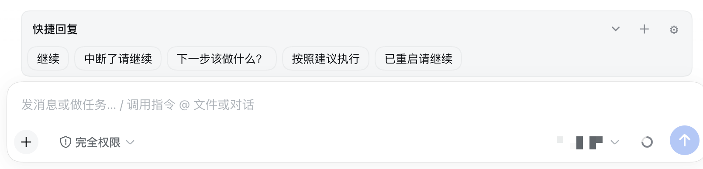

<h1 align="center">DSH Quick Replies</h1>

<p align="center">Manageable one-tap replies in the DeepSeek Harness session composer.</p>

<p align="center">
  <a href="https://www.npmjs.com/package/dsh-quick-replies"></a>
  <a href="https://github.com/idoall/dsh-quick-replies/actions/workflows/ci.yml"></a>
  <a href="LICENSE"></a>
</p>

<p align="center">English | <a href="README.zh.md">中文</a></p>

<p align="center">
  <a href="#what-it-does">What it does</a> ·
  <a href="#quick-start">Quick start</a> ·
  <a href="#usage">Usage</a> ·
  <a href="#uninstall">Uninstall</a> ·
  <a href="CHANGELOG.md">Changelog</a>
</p>

> DSH Quick Replies is a DeepSeek Harness community plugin. It mounts above the current session composer and does not modify DSH source.

A row of stored text chips sits above the input. A tap sends them as an ordinary user message: `queue` while idle, `steer` when the top-level session is running (handled at the next safe boundary). The plugin never rewrites the draft, never cancels, and never stops work.

The reply library lives in the DSH Host global settings namespace `quick-replies`, shared across browsers and devices on the same Host. Fold preferences are remembered per browser.

<p align="center">
  
</p>

## What it does

- **One tap to send**: store short phrases (for example “continue”) as chips and send them as plain text.
- **Queue when idle, steer when running**: it never claims to interrupt a running turn; timing is decided by DSH.
- **Draft stays intact**: send goes through the public session `prompt` API. Draft text, citations, images, and the cursor are left alone.
- **Manageable**: add, edit, delete, enable/disable, reorder, and import/export JSON.
- **Folds on narrow layouts**: narrow containers collapse to one row; expanded height is capped and long lists scroll inside the bar.
- **Blank-session guard**: sending is refused in a brand-new session with no history, so a resume chip cannot accidentally create an empty conversation.

## Quick start

Requirements:

- DeepSeek Harness with a Web profile
- Node.js 20 or newer
- Verified DSH version: `0.1.5-rc.1` (plugin `0.1.2`)

If the `dsh` command is already installed:

```sh
dsh plugin --profile web add dsh-quick-replies@latest
```

From DeepSeek Harness source:

```sh
corepack enable; pnpm install
pnpm dsh plugin --profile web add dsh-quick-replies@latest
```

Or install via the plugin market (optional):

```sh
dsh plugin --profile web add dshmarket
```

Restart DSH, then search for dsh-quick-replies under **Settings → Plugin market**.

Local development (link this repo):

```sh
pnpm install
pnpm run build
dsh plugin --profile web add "link:$(pwd)"
```

Refresh the web UI after install. The host half registers the settings namespace through `cordis.patch.yml`; the client mounts the bar on `conversation.input.dock`. The library is stored in the `quick-replies` section of `~/.dsh/settings.yaml`, not in the plugin install directory.

## Usage

1. Open an existing session (do not tap resume-style chips on a blank new chat).
2. The bar appears above the composer. Narrow layouts collapse by default; tap the title or chevron to expand.
3. Tap a chip to send. Idle sessions show “submitted (queue)”; running sessions show that it will be handled at the next boundary.
4. Tap **＋** to add a reply: fill in the label and body, save, and the chip appears on the bar immediately.
5. Tap **⚙** to manage replies: edit, delete, reorder, import, or export JSON.

Four defaults ship with the plugin and can all be deleted; they are not recreated automatically: continue, continue after interrupt, what should I do next?, continue after restart.

## Compatibility

Current release: plugin **`0.1.2`** is verified against DeepSeek Harness **`0.1.5-rc.1`**.

| Plugin | Verified DeepSeek Harness |
| --- | --- |
| `0.1.0`–`0.1.1` | `0.1.2-rc.1` |
| `0.1.2` | `0.1.5-rc.1` |

Use `0.1.2` on DSH `0.1.5-rc.1`. Stay on `0.1.1` (or earlier) while still on DSH `0.1.2-rc.1`. Newer DSH releases are not auto-declared compatible. If incompatible, disable or uninstall the plugin — do not patch DSH core.

## Uninstall

```sh
dsh plugin --profile web remove dsh-quick-replies
```

Uninstall does not delete the settings library. To wipe it, export JSON from Manage first, then remove the `quick-replies` namespace from settings.

## Development

```sh
pnpm install
pnpm run test
pnpm run build
```

Pushing a `v*` tag runs GitHub Actions: tests, pack, optional npm publish when `NPM_TOKEN` is set, and a GitHub Release.

MIT. See [LICENSE](LICENSE).
