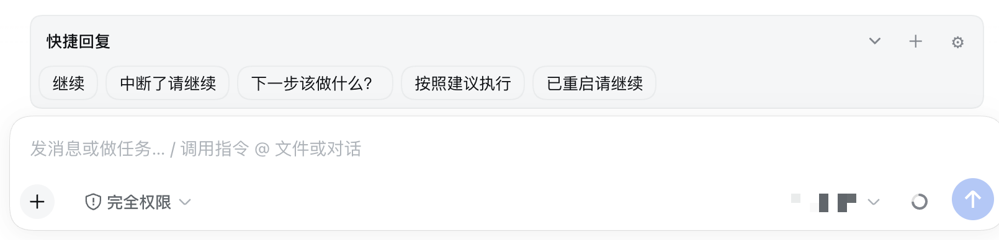

<h1 align="center">DSH Quick Replies</h1>

<p align="center">在 DeepSeek Harness 会话输入区提供可管理的快捷回复，一点即发。</p>

<p align="center">
  <a href="https://www.npmjs.com/package/dsh-quick-replies"></a>
  <a href="https://github.com/idoall/dsh-quick-replies/actions/workflows/ci.yml"></a>
  <a href="LICENSE"></a>
</p>

<p align="center"><a href="README.md">English</a> | 中文</p>

<p align="center">
  <a href="#能做什么">能做什么</a> ·
  <a href="#安装">安装</a> ·
  <a href="#使用">使用</a> ·
  <a href="#兼容性">兼容性</a> ·
  <a href="CHANGELOG.md">更新记录</a>
</p>

> DeepSeek Harness 社区插件，挂在当前会话输入区上方，不修改 DSH 源码。
>
> **已支持 DSH `0.2.1-alpha.1`。** 已针对它验证，同时兼容 `0.2.0-rc.2`、`0.2.0-rc.1` 与 `0.1.7` 线——插件 `0.1.9`。

输入框上方显示一排快捷文本。点击后作为普通用户消息发送：会话空闲时进队列，运行中则在下一个安全边界 steer。不改草稿、不 cancel、不 stop。

回复库是 Host 上的一个设置条目（`dsh-quick-replies`），同一 Host 下所有浏览器和设备看到的是同一份。折叠状态按浏览器分别记住。

<p align="center">
  
</p>

## 能做什么

- **一点即发。** 把常用短句（如「继续」）存成 chip，点击就是一条普通文本消息。
- **空闲 queue、运行中 steer。** 不会声称打断正在跑的回合，实际时机由 DSH 决定。
- **草稿不动。** 发送走会话公开的 `prompt`，正文、引用、图片、光标都保持原样。
- **可管理。** 添加、编辑、删除、启用/停用、排序、JSON 导入导出。
- **窄屏折叠。** 空间不足时折成一行，条目多则在栏内滚动。
- **空会话保护。** 没有历史消息的会话拒绝发送，避免误点开出废会话。

## 安装

需要带 Web profile 的 DeepSeek Harness，以及 Node.js 20 或更新版本。

```sh
dsh plugin --profile web add dsh-quick-replies@latest
```

直接使用 DSH 源码：

```sh
corepack enable; pnpm install
pnpm dsh plugin --profile web add dsh-quick-replies@latest
```

也可以走插件市场：

```sh
dsh plugin --profile web add dshmarket
```

重启 DSH 后，在 **设置 → 插件市场** 里搜索 dsh-quick-replies。

本地开发改成 link 本仓库：

```sh
pnpm install
pnpm run build
dsh plugin --profile web add "link:$(pwd)"
```

装完刷新 Web 界面。回复库写在该条目的 `config` 里，落在 profile 的 `cordis.patch.yml`（`~/.dsh/profiles/<profile>/cordis.patch.yml`），不在插件目录——所以重装或升级插件都不会动你的条目。

## 使用

1. 打开一个已有消息的会话。
2. 输入区上方出现快捷回复栏。窄屏默认折叠，点标题或箭头展开。
3. 点 chip 发送。空闲会话提示进入队列，运行中的提示将在下一步处理。
4. 点 **＋** 添加：填标题和正文，保存后立刻出现在栏上。
5. 点 **⚙** 管理：编辑、删除、排序、导入/导出 JSON。

默认四条，删掉就不会再回来：继续、中断了请继续、下一步该做什么？、已重启请继续。

### 局域网页面

DSH 对来源不是 loopback 的页面会关闭 Host 设置持久化，所有依赖设置的界面随之失效——经局域网转发（`dsh-lan-proxy`、`dsh-bridge`、`dsh-mobile`）访问时，本插件显示「回复库不可用」。

插件改用与官方 settings 客户端相同的公开 Remote，因此读取、编辑、导入导出仍作用于 Host 上那一份共享条目；写入被拒会明确提示冲突，而不是静默覆盖。回环页面继续走官方设置表单。

若你更想保持 DSH 官方策略（非回环页面完全不落地设置），请停留在插件 `0.1.2`；或让转发侧声明宿主身份，在返回的 HTML 中、`__DSH_BOOT__` 之前注入：

```js
window.__DSH_TRANSPORT__ = { fetch: (input, init) => window.fetch(input, init), ownsHost: true }
```

DSH 的 loopback 判定会据此为真，依赖设置的界面一并恢复；`dsh-mobile` 网关就是这么做的。

## 兼容性

当前发布 `0.1.9` 已针对 DSH `0.2.1-alpha.1` 验证，同时兼容 `0.2.0-rc.2`、`0.2.0-rc.1` 与 `0.1.7` 线（`0.1.7-rc.2`、`0.1.7-rc.1`、`0.1.7-alpha.2`）。

| 插件 | DSH | 说明 |
| --- | --- | --- |
| `0.1.0`–`0.1.1` | `0.1.2-rc.1` | |
| `0.1.2` | `0.1.5-rc.1` | |
| `0.1.3` | `0.1.5-rc.1` | 比 `0.1.7-alpha.2` 更旧的 DSH 用这一版 |
| `0.1.4` | `0.1.7-alpha.2` | |
| `0.1.5` | `0.1.7-rc.1` | |
| `0.1.6` | `0.1.7-rc.2` | |
| `0.1.7` | `0.2.0-rc.1` | 在 `0.2.0-rc.2` 上会被 DSH 跳过，请升级到 `0.1.8`+ |
| `0.1.8` | `0.2.0-rc.2` | |
| **`0.1.9`** | **`0.2.1-alpha.1`** | 当前发布 |

从任何更早的 `0.1.x` 升级都无需迁移数据、无需改配置。比表中更新的 DSH 版本，在实测之前不会声明兼容；万一不兼容，请禁用或卸载插件，不要给 DSH 核心打补丁。

## 卸载

```sh
dsh plugin --profile web remove dsh-quick-replies
```

卸载不会删除回复库。要一并清掉，先在管理界面导出 JSON，再删掉 profile 的 `cordis.patch.yml` 中 `dsh-quick-replies` 条目的 `config`。

## 开发

```sh
pnpm install
pnpm run test
pnpm run build
```

`pnpm run test` 会跑 `tsc --noEmit` 和全部 vitest 项目：共享/Host 逻辑、客户端逻辑、jsdom UI 用例，以及一条按 DSH 方式加载 `lib/` 的构建产物用例。先 build 一次，产物用例才有东西可加载。

推送 `v*` 标签后，GitHub Actions 会跑版本与发版说明门禁、测试、打包，通过 npm 可信发布（OIDC，不需要 `NPM_TOKEN`）发布，并用 `docs/releases/<tag>.md` 创建 GitHub Release。

MIT，详见 [LICENSE](LICENSE)。
